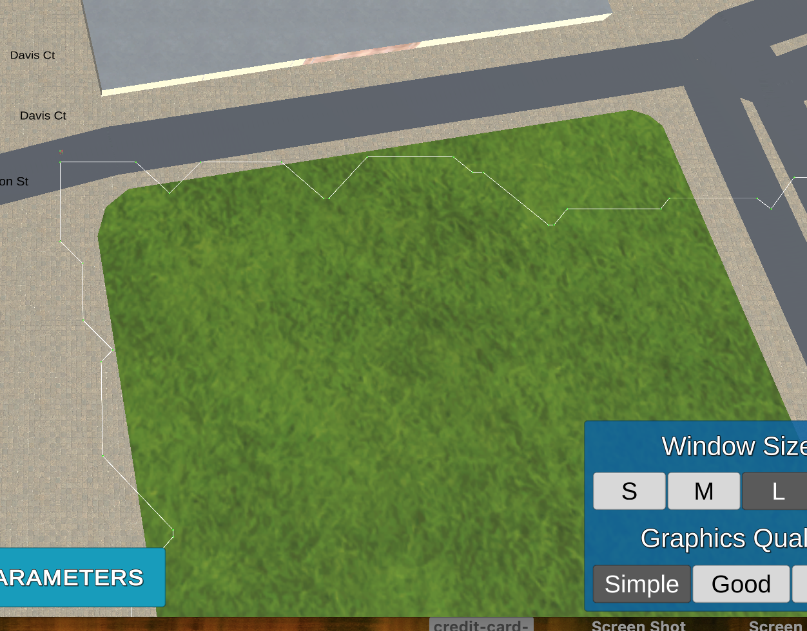
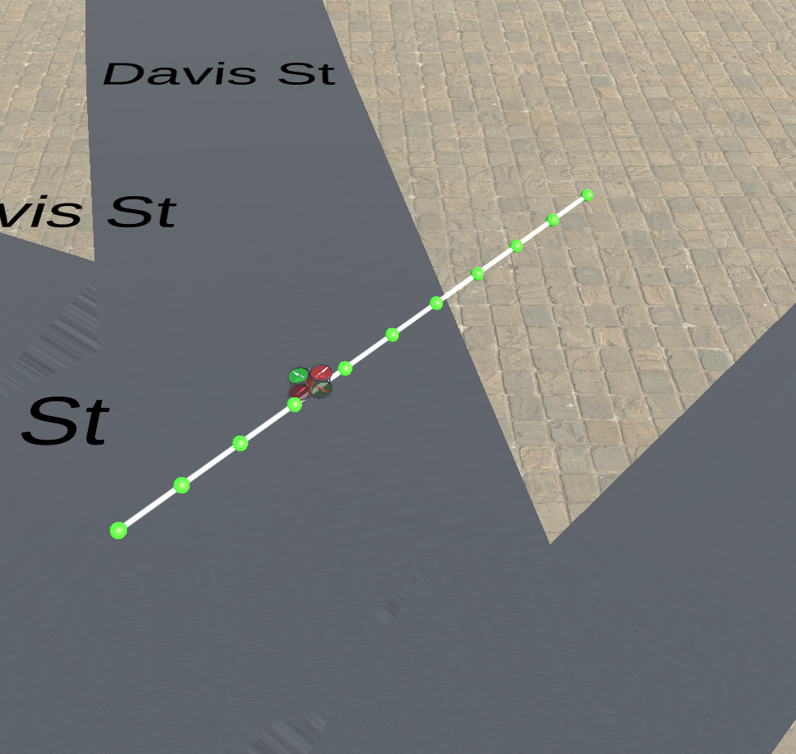
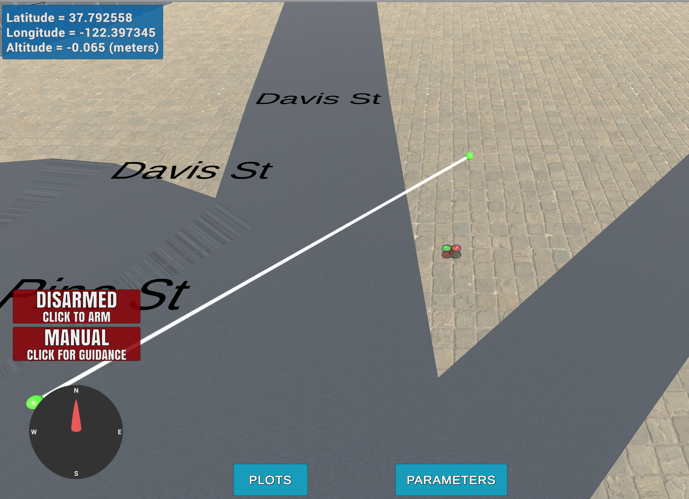

# Project Writeup

## Explain the Starter Code

1. Motion planning adds a new state planning

2. Both scripts register the same callbacks on initialization for position, velocity, and state changes.

3. All callbacks are the same except motion planning doesn’t calculate the box path in the position callback and instead calculates a plan after arming then adds a planning state to the state callback that triggers the takeoff transition

4. The transitions are all essentially the same.

5. Motion planning has `plan_path` instead of `calculate_box` to determine the waypoints or path to fly.  `plan_path` sets the target altitude and safety distance, contains todos for position initialization, reads in the obstacle data, then generates a grid. Start and goal points are initialized with todos for setting start to the current position and goal as lat/lon.  A* is then run with todos for diagnol distances, path pruning, and another possible approach. The end result of `plan_path` is to then convert the path found by A* to waypoints, set this for the class, and pass to the simulator.

## Implementing Your Path Planning Algorithm

1. Read in first line of colliders.csv and use to set home position

Read the line in using `with` so the file is closed.  Not ideal since it is opened again immediately to load the data so could refactor.  Split the line on the comma, strip extra white space on the edges, then split on white space in the middle, take the trailing part and convert to float prior to passing to `set_home_position`.  Regex may be more robust.

2. Set local position

Create a `global_position` variable from the drones current position using `self._latitude`, `self._longitude`, and `self._altitude`.  Then create `current_local_position` variable using the `global_to_local` utility function with `global_position` and the previously set `self.global_home`.

3. Set start position to current local position

Through trial and error figured out start needs to be integers and it should be adjusted by the offset.  Later tried to add a random start position option but couldn't get to work properly and is flagged off.

4. Set goal position to arbitrary location in the grid

Set an arbitrary lat and lon then convert to local for goal grid coordinates.  First pass just set a valid lat/lon with `np.array([-122.39747, 37.79275, TARGET_ALTITUDE])`.  Then after completing rest of TODOs, refactored to use `randomPoint`, a function that generates a random lat/lon inside the grid and checks for collisions.  Seems like the path isn't always optimal and sometimes has random zig/zags.



5. Write your search algorithm

First pass add diagonal actions to grid search.  In `planning_utils` add to the `action` enum the 4 corners. Then in `valid_actions` function add the 4 diagnol actions with the appropriate costs.  Verify works by flying to `grid_goal = (325, 455)` which was jagged and is now straight.



6. Prune the path

Add `collinearity_check` function that performs a 2d integer collinearity check.  Iterate through the path, deleting collinear points, to create a pruned_path that is then used to create the waypoints. Verify works by flying to `grid_goal = (325, 455)` which was about 10 points and should be two.



7. Try a Different Approach - Probabilistic Graph Search

Toggle with flag `GRAPH_SEARCH`. Get random samples.  Create polygons for obstacles.  Keep samples that don't collide with polygons.  Create a graph with NetworkX between nodes whose edges don't pass through obstacles.  Then determine the graph points closes to the start and goal.  Perform an A* search on the graph.  Add start and goal to the path and replace the `pruned_path` variable that is used to generate the waypoints with the new path values adjusted for offsets.  If no path is returned, remove the goal and just takeoff and land at the same spot. Would have liked to figure out 3D altitude traversal but just kept to target altitude.  Didn't get it to work too well: sometimes can't find a path, sometimes gets stuck in takeoff transition, sometimes path hits an obstacle.  Needs more work.


------ ORIGINAL README ------

# FCND - 3D Motion Planning


This project is a continuation of the Backyard Flyer project where you executed a simple square shaped flight path. In this project you will integrate the techniques that you have learned throughout the last several lessons to plan a path through an urban environment. Check out the [project rubric](https://review.udacity.com/#!/rubrics/1534/view) for more detail on what constitutes a passing submission.

## Option to do this project in a GPU backed virtual machine in the Udacity classroom!
Rather than downloading the simulator and starter files you can simply complete this project in a virual workspace in the Udacity classroom! Follow [these instructions](https://classroom.udacity.com/nanodegrees/nd787/parts/5aa0a956-4418-4a41-846f-cb7ea63349b3/modules/0c12632a-b59a-41c1-9694-2b3508f47ce7/lessons/5f628104-5857-4a3f-93f0-d8a53fe6a8fd/concepts/ab09b378-f85f-49f4-8845-d59025dd8a8e?contentVersion=1.0.0&contentLocale=en-us) to proceed with the VM. 

## To complete this project on your local machine, follow these instructions:
### Step 1: Download the Simulator
This is a new simulator environment!  

Download the Motion-Planning simulator for this project that's appropriate for your operating system from the [simulator releases respository](https://github.com/udacity/FCND-Simulator-Releases/releases).

### Step 2: Set up your Python Environment
If you haven't already, set up your Python environment and get all the relevant packages installed using Anaconda following instructions in [this repository](https://github.com/udacity/FCND-Term1-Starter-Kit)

### Step 3: Clone this Repository
```sh
git clone https://github.com/udacity/FCND-Motion-Planning
```
### Step 4: Test setup
The first task in this project is to test the [solution code](https://github.com/udacity/FCND-Motion-Planning/blob/master/backyard_flyer_solution.py) for the Backyard Flyer project in this new simulator. Verify that your Backyard Flyer solution code works as expected and your drone can perform the square flight path in the new simulator. To do this, start the simulator and run the [`backyard_flyer_solution.py`](https://github.com/udacity/FCND-Motion-Planning/blob/master/backyard_flyer_solution.py) script.

```sh
source activate fcnd # if you haven't already sourced your Python environment, do so now.
python backyard_flyer_solution.py
```
The quad should take off, fly a square pattern and land, just as in the previous project. If everything functions as expected then you are ready to start work on this project. 

### Step 5: Inspect the relevant files
For this project, you are provided with two scripts, `motion_planning.py` and `planning_utils.py`. Here you'll also find a file called `colliders.csv`, which contains the 2.5D map of the simulator environment. 

### Step 6: Explain what's going on in  `motion_planning.py` and `planning_utils.py`

`motion_planning.py` is basically a modified version of `backyard_flyer.py` that leverages some extra functions in `planning_utils.py`. It should work right out of the box.  Try running `motion_planning.py` to see what it does. To do this, first start up the simulator, then at the command line:
 
```sh
source activate fcnd # if you haven't already sourced your Python environment, do so now.
python motion_planning.py
```

You should see the quad fly a jerky path of waypoints to the northeast for about 10 m then land.  What's going on here? Your first task in this project is to explain what's different about `motion_planning.py` from the `backyard_flyer_solution.py` script, and how the functions provided in `planning_utils.py` work. 

### Step 7: Write your planner

Your planning algorithm is going to look something like the following:

- Load the 2.5D map in the `colliders.csv` file describing the environment.
- Discretize the environment into a grid or graph representation.
- Define the start and goal locations. You can determine your home location from `self._latitude` and `self._longitude`. 
- Perform a search using A* or other search algorithm. 
- Use a collinearity test or ray tracing method (like Bresenham) to remove unnecessary waypoints.
- Return waypoints in local ECEF coordinates (format for `self.all_waypoints` is [N, E, altitude, heading], where the drone’s start location corresponds to [0, 0, 0, 0]). 

Some of these steps are already implemented for you and some you need to modify or implement yourself.  See the [rubric](https://review.udacity.com/#!/rubrics/1534/view) for specifics on what you need to modify or implement.

### Step 8: Write it up!
When you're finished, complete a detailed writeup of your solution and discuss how you addressed each step. You can use the [`writeup_template.md`](./writeup_template.md) provided here or choose a different format, just be sure to describe clearly the steps you took and code you used to address each point in the [rubric](https://review.udacity.com/#!/rubrics/1534/view). And have fun!

## Extra Challenges
The submission requirements for this project are laid out in the rubric, but if you feel inspired to take your project above and beyond, or maybe even keep working on it after you submit, then here are some suggestions for interesting things to try.

### Try flying more complex trajectories
In this project, things are set up nicely to fly right-angled trajectories, where you ascend to a particular altitude, fly a path at that fixed altitude, then land vertically. However, you have the capability to send 3D waypoints and in principle you could fly any trajectory you like. Rather than simply setting a target altitude, try sending altitude with each waypoint and set your goal location on top of a building!

### Adjust your deadbands
Adjust the size of the deadbands around your waypoints, and even try making deadbands a function of velocity. To do this, you can simply modify the logic in the `local_position_callback()` function.

### Add heading commands to your waypoints
This is a recent update! Make sure you have the [latest version of the simulator](https://github.com/udacity/FCND-Simulator-Releases/releases). In the default setup, you're sending waypoints made up of NED position and heading with heading set to 0 in the default setup. Try passing a unique heading with each waypoint. If, for example, you want to send a heading to point to the next waypoint, it might look like this:

```python
# Define two waypoints with heading = 0 for both
wp1 = [n1, e1, a1, 0]
wp2 = [n2, e2, a2, 0]
# Set heading of wp2 based on relative position to wp1
wp2[3] = np.arctan2((wp2[1]-wp1[1]), (wp2[0]-wp1[0]))
```

This may not be completely intuitive, but this will yield a yaw angle that is positive counterclockwise about a z-axis (down) axis that points downward.

Put all of these together and make up your own crazy paths to fly! Can you fly a double helix?? 


Ok flying a double helix might seem like a silly idea, but imagine you are an autonomous first responder vehicle. You need to first fly to a particular building or location, then fly a reconnaissance pattern to survey the scene! Give it a try!